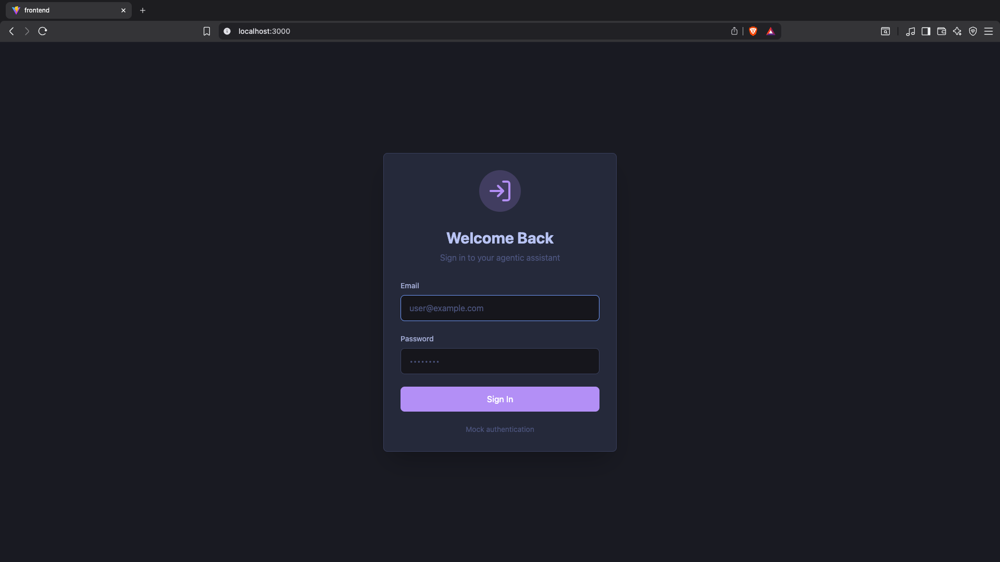
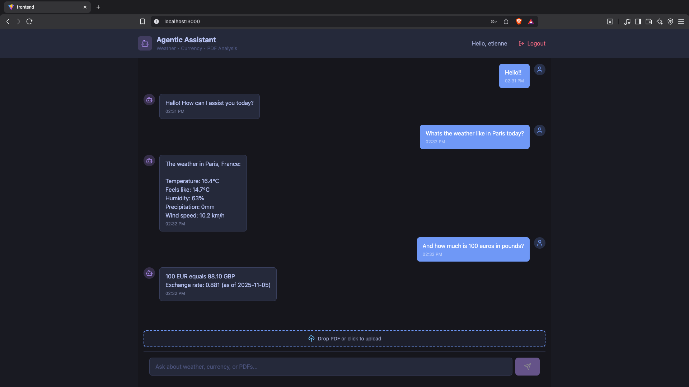

A demonstration of agentic AI using tool calling. The LLM autonomously decides when to use three specialized tools: currency conversion, weather information, and PDF reading.




## Features

- **Agentic AI**: Model decides autonomously when to use tools
- **3 Integrated Tools**: Weather, currency conversion, PDF analysis
- **Streaming Responses**: Real-time AI responses via SSE
- **Containerized**: Single command deployment

## Quick Start

### Prerequisites
- Docker & Docker Compose
- 8GB RAM minimum

### Installation

**With NVIDIA GPU:**
```bash
docker compose -f docker-compose.nvidia.yml up
```

**CPU Only (Mac/Windows/Linux):**
```bash
docker compose up
```

On first run, the Qwen2.5 1.5B model (~980MB) will be downloaded automatically.

**Access:** http://localhost:3000

## Tools

| Tool | Function | Example |
|------|----------|---------|
| Weather | Current weather data | "What's the weather in Tokyo?" |
| Currency | Exchange rates | "Convert 100 USD to BRL" |
| PDF Reader | Extract text from PDFs | *Upload PDF* "Summarize this" |

## Architecture

```
Frontend (React + TypeScript)
    ↓ HTTP + SSE
Backend (Node.js + Express)
    ↓ Tool orchestration
Ollama (Qwen2.5 1.5B)
```

## Tech Stack

**Frontend:** React 18, TypeScript, Vite, Tailwind CSS  
**Backend:** Node.js, Express, Vercel AI SDK  
**AI/ML:** Ollama, Qwen2.5 1.5B Instruct (Q4_K_M quantized)

## Project Structure

```
├── frontend/          # React app
├── backend/           # Node.js server
│   └── src/tools/     # Tool implementations
├── assets/            # Screenshots
├── docker-compose.yml
└── docker-compose.nvidia.yml
```
## Future Enhancements

- RAG integration for document retrieval
- Additional tools (web search, image generation)
- Tool enable/disable UI
- Multi-turn conversation memory

## Troubleshooting

**Slow download?** First run downloads 980MB model  
**PDF not readable?** OCR support planned for scanned documents  
**Out of memory?** Ensure 8GB+ RAM available  
**GPU not detected?** Verify NVIDIA Container Toolkit:
```bash
docker run --rm --gpus all nvidia/cuda:11.8.0-base-ubuntu22.04 nvidia-smi
```

## Development

```bash
# Backend
cd backend && npm install && npm run dev

# Frontend  
cd frontend && npm install && npm run dev

# Ollama (local)
ollama serve
ollama pull qwen2.5:1.5b-instruct-q4_K_M
```

## API Reference

### POST /chat

Endpoint for chat interactions with tool calling support.

**Request:**
```typescript
{
  message: string;
  pdf?: File;  // Optional PDF upload
}
```

**Response:** Server-Sent Events (SSE) stream with:
- Text chunks
- Tool calls
- Tool results

## License

MIT
